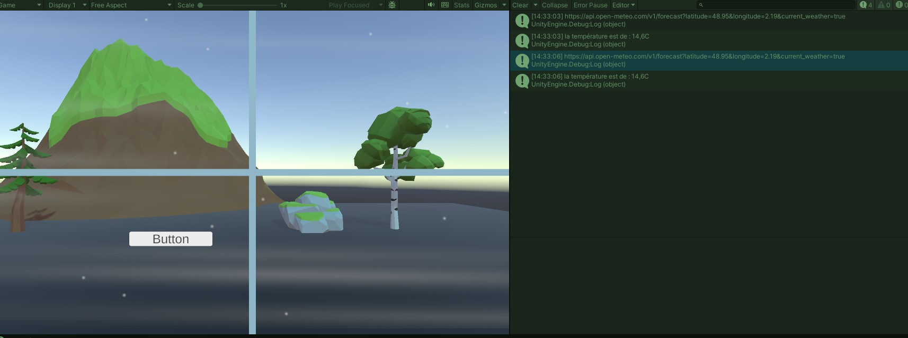

## API Meteo

Hello I'm [Nicolas](https://www.linkedin.com/in/taillepierrenicolas/) a learning software developer  
This project was made to learn how to call APIs in Unity  
The game would call a meteo API to check the current meteo at a specific point in the world and change the color temperature and windspeed in the scene accordingly
